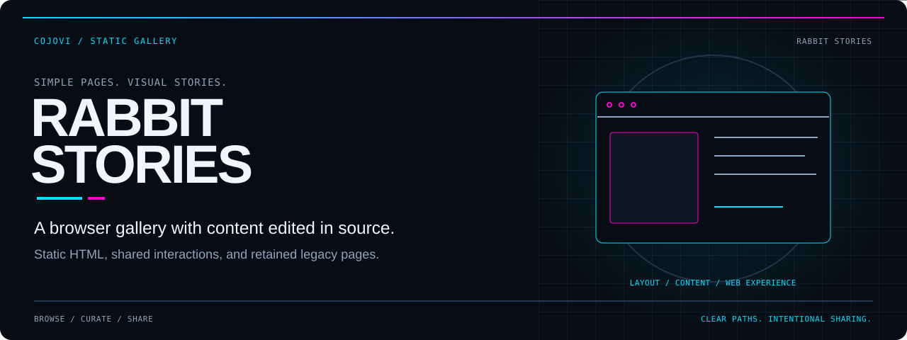
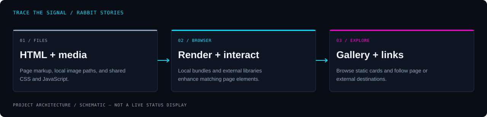

<!-- COJOVI / SIGNAL — Rabbit Stories project edition. Keep readme-assets/ with this file. -->
<a name="top"></a>

<p align="center">
  
</p>

<h1 align="center">Rabbit Stories</h1>

<p align="center">
  <strong>Browse the gallery. Follow the stories. Keep the site simple.</strong><br>
  A static HTML, CSS, and JavaScript showcase in the rabbit_cam repository.
</p>

<p align="center">
  
</p>

<p align="center">
  <a href="#overview">Overview</a> ·
  <a href="#architecture">Architecture</a> ·
  <a href="#quickstart">Quickstart</a> ·
  <a href="#configuration">Content</a> ·
  <a href="#validation">Validation</a> ·
  <a href="#security">Privacy</a>
</p>

---

<a name="overview"></a>
## `> meet_the_gallery`

**The current homepage identifies itself as `#rabbit.stories`.** It presents a collection of image cards, using the same static site assets as several retained CMAC-era pages. Content is edited directly in HTML; there is no content database or administration service in this repository.

Despite the repository name **rabbit_cam**, the reviewed source is a **gallery website**, not a camera driver, webcam server, Rabbit device integration, or model-training pipeline. The older README's Node.js and custom-AI descriptions do not correspond to a tracked application backend.

| Browse | Present | Adapt |
| :--- | :--- | :--- |
| View the image-card collection in the homepage markup. | Reuse shared styling and browser-side menu, animation, and slider code. | Edit static content, local assets, and navigation without a package build. |

> [!IMPORTANT]
> **Static does not mean self-contained or private.** Pages load external JavaScript, and the contact page includes an external map. Legacy contact details and navigation remain in source. Review those before opening or publishing your own copy.

<a name="architecture"></a>
## `> trace_the_gallery`

<p align="center">
  
</p>

```text
HTML pages + css/ + js/ + img/
                ↓
Browser renders cards and shared navigation
  ├─ local app.min.js and style.min.css
  └─ external Swiper, Rellax, and Typed libraries
                ↓
Gallery browsing / page links / external destinations
```

[The homepage](index.html) contains the gallery content directly. [js/app.js](js/app.js) is the readable companion to the minified script loaded by the HTML pages; it includes menu handling, WebP detection, popups, sliders, and animation helpers.

Those helpers are shared site code, not proof that every behavior is active on every page. Several initialize only when matching elements are present. External libraries remain separate dependencies loaded by the browser.

<a name="quickstart"></a>
## `> preview_a_copy`

**Prerequisites:** Git, a text editor, a browser, and Python 3 for the optional static preview command below. Python is a convenient local server, not an application dependency supplied by this repository.

### 1. Get the source

```bash
git clone --branch main https://github.com/cojovi/rabbit_cam.git
cd rabbit_cam
```

There is no `package.json`, npm lockfile, framework configuration, or build script. Do not run `npm install` or expect a Node.js application entry point.

### 2. Review the files before loading them

Inspect `index.html` and any secondary pages you intend to use. Replace contact information, external links, and site-specific content in a private working copy. Review external script and map requests; loopback hosting does not prevent browser requests to third parties.

The repository includes media assets and legacy pages. Keep the directory layout intact so relative paths continue to resolve. No existing photo or illustration is licensed or described by this README merely because its filename is present.

### 3. Serve only the intended working copy

```bash
python3 -m http.server 8000 --bind 127.0.0.1
```

Open **http://127.0.0.1:8000/** in your browser after the content review. Stop the server with **Ctrl+C**. This standard-library server is for local inspection, not production hosting or access control.

It serves files from its working directory, not just the homepage. Use a sanitized copy for preview and do not expose the listener to a public network. No backend service, database, camera, or device connection is needed to serve these files.

<a name="configuration"></a>
## `> curate_the_cards`

| Change | Edit | Keep in mind |
| :--- | :--- | :--- |
| Gallery content | [index.html](index.html) | Cards and image paths are maintained in HTML. |
| Readable styling | [css/style.css](css/style.css) | Pages load the minified sibling. |
| Served styling | [css/style.min.css](css/style.min.css) | Keep this aligned with any source-style changes. |
| Readable behavior | [js/app.js](js/app.js) | Shared helpers depend on matching markup. |
| Served behavior | [js/app.min.js](js/app.min.js) | This is the script referenced by pages. |
| Media files | [img/](img/) | Preserve filename case and verify rights before reuse. |
| Library sources | Script tags in each HTML file | Review CDN versions and availability. |

There is no environment-variable loader or secret store to configure. Site identity, contact information, navigation, and third-party resource references live directly in source.

The repository does not provide a reproducible minification command or source package for its CSS/JavaScript bundles. Editing only `style.css` or `app.js` will not automatically update the minified files that pages load. Establish a deliberate asset workflow before changing shared behavior.

### Keep media markup consistent

When adding or replacing a card, update all relevant `picture`, `source`, and `img` paths, along with meaningful alternative text. Check the fallback asset independently from any preferred format. Filenames with spaces or apostrophes need correct HTML quoting and URL handling.

Use images you are entitled to publish. This documentation does not identify depicted people, infer image contents from names, or claim that a particular device or AI service produced the assets.

<a name="usage"></a>
## `> map_the_pages`

| Page | Role in the reviewed source |
| :--- | :--- |
| [index.html](index.html) | Current `#rabbit.stories` gallery. |
| [cmac copy.html](cmac%20copy.html) | Retained `#CMACstories` variant. |
| [contacts.html](contacts.html) | Contact page with an external map embed. |
| [austin.html](austin.html) | Separate contact-oriented page. |
| [old_index.html](old_index.html) | Earlier Tech.CMAC landing page with local video references. |

These are individual documents, not application routes managed by a router. A direct file request must resolve to an actual filename on the host.

> [!NOTE]
> Several pages link to **`cmac.html`**, but no such file is tracked. The existing **`cmac copy.html`** has a different name and is not an automatic substitute. Decide whether to repair the links or deliberately restore a page before deployment.

The legacy landing page also references missing career-image variants. A clean server start would not establish that every page, link, or media path is intact.

<a name="validation"></a>
## `> check_the_paths`

**Application builds and tests were not run for this documentation work.** No automated test suite, build pipeline, or GitHub Actions workflow is tracked in the reviewed tree.

Before sharing a copy:

- [ ] Review contact records and external destinations in every included page.
- [ ] Decide which legacy pages belong in the intended site.
- [ ] Repair references to the absent `cmac.html` page.
- [ ] Check local media paths, including legacy career-image references.
- [ ] Verify `picture` sources and fallback images independently.
- [ ] Keep readable and minified CSS/JavaScript changes aligned.
- [ ] Check library loading and behavior when external scripts are unavailable.
- [ ] Check keyboard navigation, menu state, and small-screen layouts.
- [ ] Review animation and autoplay behavior for accessibility.
- [ ] Confirm media permissions and useful alternative text.
- [ ] Publish only the files intended for public access.

A source-only audit can identify missing tracked paths and integration boundaries. It does not verify browser rendering, external service availability, media contents, or a live deployment.

<a name="source-map"></a>
## `> explore_the_source`

| Path | Responsibility |
| :--- | :--- |
| [index.html](index.html) | Main gallery markup and resource references. |
| [css/](css/) | Readable and minified shared styles. |
| [js/](js/) | Readable and minified shared browser behavior. |
| [img/stories/](img/stories/) | Gallery media collection. |
| [img/home/](img/home/) | Assets referenced by retained site layouts. |
| [contacts.html](contacts.html) · [austin.html](austin.html) | Contact-oriented documents requiring a privacy review. |

<a name="security"></a>
## `> share_with_intent`

- **There is no application access-control layer.** Anything deployed as a static file can be retrieved directly, whether or not it appears in navigation.
- **Contact links are not a messaging backend.** Review destinations and consent; do not test them by sending live messages.
- **Third-party resources can receive visitor requests.** External libraries and embedded maps should be reviewed for privacy, availability, and update policy.
- **Exclude unintended files.** The source includes legacy content and miscellaneous files outside the main gallery; do not publish the entire checkout without reviewing it.

### Attribution and license

Maintained in **[cojovi/rabbit_cam](https://github.com/cojovi/rabbit_cam)**, with retained Tech.CMAC/CMAC page identity. GitHub metadata does not mark this repository as a fork. Swiper, Rellax, and Typed are separate projects; retain applicable third-party notices.

**No root license file was found in the reviewed revision.** Public availability does not supply a blanket software or media reuse license. Clarify permissions with the owner before redistribution.

---

<p align="center">
  
</p>

<p align="center">
  <strong>Simple pages. Clear paths. Intentional sharing.</strong><br>
  <sub>A <a href="https://github.com/cojovi">Cody / cojovi</a> project · <a href="https://cojovi.com">cojovi.com</a><br>
  Rabbit Stories · Presented in COJOVI / SIGNAL.</sub>
</p>

<p align="center"><a href="#top">↑ Back to the signal</a></p>
